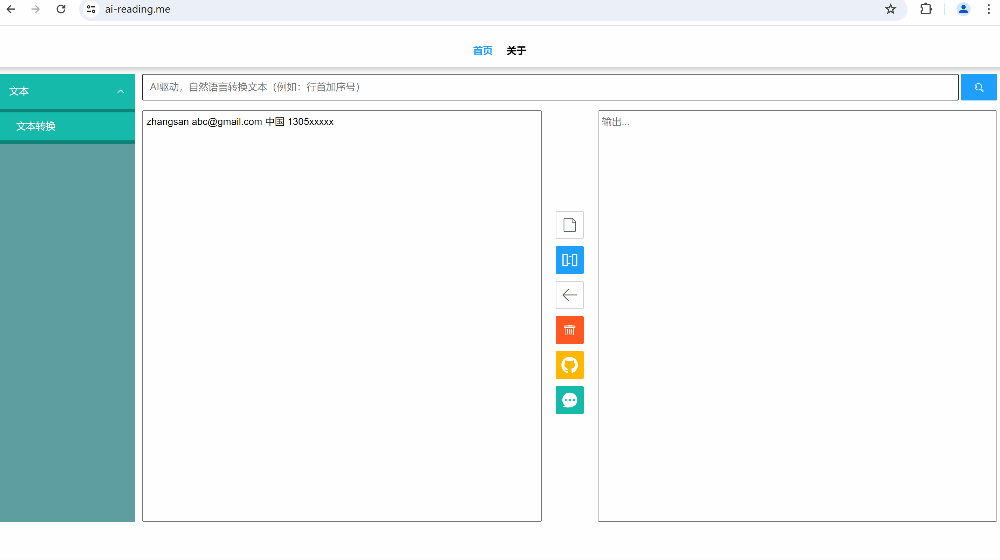

# Ai Exchange

> 代码仅包含前端部分。

## 项目介绍

本项目旨在通过大模型和AI技术，将自然语言转换为编程语言指令，使得非专业用户可以轻松进行文本转换和处理。

体验地址：[Ai-Exchange](https://ai-reading.me)，PC、手机端均适配

> 项目开发中，上线部分功能

## 录屏展示

### 文本处理


### sql生成



## 使用示例(规则只是示例，有什么要处理的像向朋友请教那样提问)

### 1. 正则匹配

规则：`匹配所有电子邮件地址`

输入：

```
请联系test@example.com或support@domain.com获取更多信息。
```

输出：

```
test@example.com, support@domain.com
```

---

输入：上面输出作为新一轮的输入，后续相同

规则：`以, 为分隔符分行展示`

输出：

```
test@example.com
support@domain.com
```

---

规则：`复制第一行5遍`

输出：

```
test@example.com
support@domain.com
test@example.com
support@domain.com
test@example.com
support@domain.com
test@example.com
support@domain.com
test@example.com
support@domain.com
```

---

规则：`行首加序号`

输出：

```
1. test@example.com
2. support@domain.com
3. test@example.com
4. support@domain.com
5. test@example.com
6. support@domain.com
7. test@example.com
8. support@domain.com
9. test@example.com
10. support@domain.com
```

---

规则：`以用户名@domain.com的形式，匹配所有的用户名加上“_xxxx”`

输出：

```
1. test_xxxx@example.com
2. support_xxxx@domain.com
3. test_xxxx@example.com
4. support_xxxx@domain.com
5. test_xxxx@example.com
6. support_xxxx@domain.com
7. test_xxxx@example.com
8. support_xxxx@domain.com
9. test_xxxx@example.com
10. support_xxxx@domain.com
```

---

规则：`删除所有的序号.`

输出：

```
test@example.com
support@domain.com
test@example.com
support@domain.com
test@example.com
support@domain.com
test@example.com
support@domain.com
test@example.com
support@domain.com
```

---

规则：`删除重复行`

输出：

```
test@example.com
support@domain.com
```

---

规则：`按ASCII将行排序`

输出：

```
support@domain.com
test@example.com
```

### 2. sql生成

输入：

```
test test@example.com 中国 130xxxxxxx
support support@domain.com 中国 130xxxxxxx
```
规则：`表为user，字段为name email address phoneNum，以每行数据空格为分隔符，生成insert语句`

输出：

```
INSERT INTO user (name, email, address, phoneNum) VALUES ('test', 'test@example.com', '中国', '130xxxxxxx');
INSERT INTO user (name, email, address, phoneNum) VALUES ('support', 'support@domain.com', '中国', '130xxxxxxx');
```

### 3. markdown格式化

输入：

```
name email address phoneNum
test test@example.com 中国 130xxxxxxx
support support@domain.com 中国 130xxxxxxx
```

规则：`第一行作为表头，以空格为分隔符，转换为markdown格式表格`

输出：

```
|name|email|address|phoneNum|
|---|---|---|---|
|test|test@example.com|中国|130xxxxxxx|
|support|support@domain.com|中国|130xxxxxxx|
```

**更多有群的玩法，访问[Ai-Exchange](https://www.ai-reading.me)体验**
